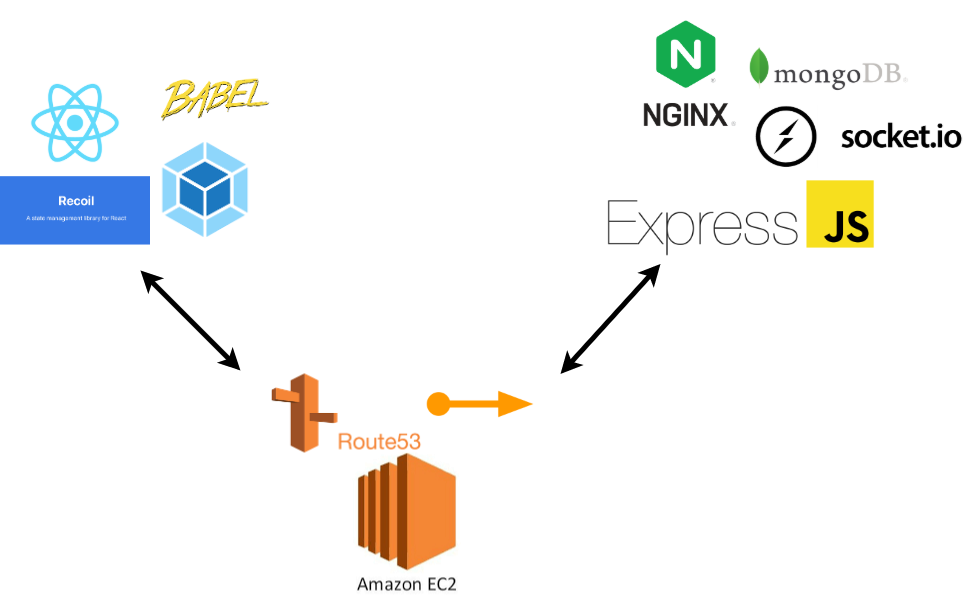

# reservation-app

## 개요

- 피아노 학원 실시간 웹 예약 사이트
- 직접 학원에 방문하여 수기로 예약일자를 작성해야 했음.
- 대부분 직장인이었기에 예약을 원하는때에 하기 힘듦.
- 플랫폼 상관이 없는 웹으로 구현.

## 개발

- Frontend
    - React
    - Recoil
    - Webpack
    - Babel

- Backend
    - NginX
    - Express
    - Socket.io
    - MongoDB

- Infra
    - AWS EC2
    - AWS Route53
    - AWS Elastic IP

## 기타

- 관리자 페이지, 카톡 API를 활용한 예약 알림 메세지 보내기 등 미구현된 부분이 있다. 
- 3주 정도 운영하고 개발 중단.